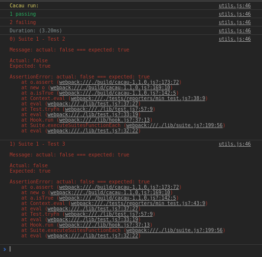

# Cacau

<p align="center">
  
</p>

## Test API in JavaScript.

### How to use Cacau

1 - Primeiro você deve baixar a Cacau:

Utilizando npm install

```shell
npm install cacau
```
Utilizando CDN:

```html
<script src="https://unpkg.com/cacau@VERSION/build/cacau-VERSION.js"></script>
```
2 - Você precisa importar a Cacau em seu projeto:

```javascript
import 'cacau';
//or
require('cacau');
```
3 - Você precisa também escolher a interface e o reporter que deseja utilizar:

```javascript
cacau.ui('NewTdd');
cacau.reporter('Min');
//or
cacau.ui('NewTdd').reporter('Min');
```
4 - Escreva seus testes(escolhi a interface "NewTdd", veja #Interfaces para ver outras interfaces disponiveis):

```javascript
suite('Suite 1', function() {
      
    test('Suite 1 - Test 1', () => {
        isTrue(true);
    });
    
    suite('Suite 2', function() {
    
        test('Suite 2 - Test 1', () => {
            isTrue(true);
        });
    
    });
    
});
```
A Cacau já vem com uma biblioteca de asserção que você pode utilizar, verifique #API para saber as funções de asserção disponiveis, mas você também pode utilizar outra bibioteca de asserção como ChaiJS por exemplo. 

```javascript
suite('Suite 1', function() {
      
    test('Suite 1 - Test 1', () => {
        expect(1).to.equal(2);
    });
    
    suite('Suite 2', function() {
    
        test('Suite 2 - Test 1', () => {
            isTrue(true);
        });
    
    });
    
});
```
### Hooks

Existem 4 tipos de hook na Cacau, eles seguem a ordem de execução apresentada abaixo: 

beforeAll - antes de todos os testes
beforeEach - antes de cada teste
afterEach - após cada teste
afterAll - após todos os testes

Os hooks da Cacau assim como as suítes, podem ser aninhados, ou seja se existe uma suíte dentro de uma suíte, os hooks da suite pai serão executados também nos testes da suíte filho. Exemplo:

```javascript
suite('Suite 1', function() {
    let x = 0;

    beforeEach(function() {
        x = 0;
    });
      
    test('Suite 1 - Test 1', () => {
        x++;
        actualEqualExpected(x, 1);
    });
    
    suite('Suite 2', function() {
    
        beforeEach(function() {
            x++;
        });
    
        test('Suite 2 - Test 1', () => {
            x++;
            actualEqualExpected(x, 2);
        });
    
    });
    
    test('Suite 1 - Test 2', () => {
        x++;
        actualEqualExpected(x, 1);
    });
    
});
```

Acima no Teste 1 da Suite 2, ambos os beforeEach serão executados, o BeforeEach da Suite 1 será executado antes do beforeEach da Suite 2. Você também pode dar uma descrição para os hooks se desejar:

```javascript
suite('Suite 1', function() {
    let x = 0;

    beforeEach('beforeEach Suite 1', function() {
        x = 0;
    });
      
    test('Suite 1 - Test 1', () => {
        x++;
        actualEqualExpected(x, 1);
    });
    
});
```
### Async Test

Você pode testar o código assincrono na Cacau facilmente apenas passando uma função "done" para a função de teste como mmostrado abaixo:

```javascript
suite('Suite 1', function() {
      
    test('Suite 1 - Test 1', (done) => {
        done();
    });
    
    test('Suite 1 - Test 1', (done) => {
        done(() => isTrue(true));
    });
    
});
```
Veja acima, você pode passar asseções como argumento para "done", você também pode passar um erro como argumento para "done", talvez esta seja a unica vantagem da Cacau em relação a outros frameworks que não suportam passar funções de asserção como argumento de "done", como o Mocha. Mocha me inspirou bastante para criar a Cacau, estudei muito seu código, e recomendo essa biblioteca, possui um código bem organizado, comparando ao Mocha, a Cacau tem mais desvantagens do que vantagens. 

### Timeout

Os timeout da Cacau podem ser aplicados em testes, suites ou hooks, os testes herdam o timeout de seu pai, a não ser que você configure um timeout no teste diretamente. Veja um exemplo:

```javascript
suite('Suite 1', function() {
    this.timeout(1);
    
    test('Suite 1 - Test 1', function() {
        let i = 0;
        while(i < 10000000) { i++; }
        isTrue(true);
    });
    
    test('Suite 1 - Test 2', () => {
        this.timeout(30000000);
        let i = 0;
        while(i < 10000000) { i++; }
        isTrue(true);
    });

});
```
Acima o Test 1 herda o timeou configurado para 1 do pai e irá falhar com o seguinte erro "TimeoutError: Time(1) extrapolated!", enquanto o Test 2 reconfigurou seu timeout para 30000000 e passa.

### Only and Skip

A funcionalidade "only" e "skip" da Cacau funcionam seguindo 4 regras de precedência:

1 - Testes only têm precedência de testes skip:

```javascript
Suite1 // run!
	test1
	test2.skip 
	suite2 // run!
		test1.only // run!
		test2
```
2 - Suítes only têm precedência de suítes skip:

```javascript
Suite1.skip // run!
	test1
	suite2.only // run!
		test1 // run!
		test2 // run!

//or

Suite1.only // run!
	test1 // run!
	suite2.skip // run!
		test1 // run!
		test2 // run!

// or

Suite1.only // run!
	test1 // run!
	suite2.skip // run!
		test1.skip // run!
		test2 // run!
```
3 - Testes skip têm precedência de suítes only:

```javascript
Suite1.only // run!
	test1 // run!
	suite2 // run!
		test1.skip
		test2 // run!
```
4 - Testes only têm precedência de suítes skip:

```javascript
Suite1.skip // run!
	test1
	suite2 // run!
		test1.only // run!
		test2
```
### Interfaces

A Cacau possui atualmente duas interfaces:

NewTdd:

```javascript
suite('Suite 1', function() {
    
    beforeAll(function() {
    
    });
    
    afterAll(function() {
    
    });
    
    beforeEach(function() {
    
    });
    
    afterEach(function() {
    
    });
      
    test('Suite 1 - Test 1', () => {
 
    });
    
});
```

Bdd:

```javascript
describe('Suite 1', function() {
    
    beforeAll(function() {
    
    });
    
    afterAll(function() {
    
    });
    
    beforeEach(function() {
    
    });
    
    afterEach(function() {
    
    });
      
    it('Suite 1 - Test 1', () => {
 
    });
    
});
```
### Reporters

A Cacau atualmente possui um unico reporter:

Min:




#### Running Cacau in the Browser:

Para utilizar a Cacau no Browser é preciso importar a Cacau de algum CDN ou localmente, abaixo é mostrado utilizando um CDN:

```html
<!DOCTYPE html>
<html>
<head>
    <meta charset="utf-8">
    <meta name="viewport" content="width=device-width, initial-scale=1">
    <meta http-equiv="X-UA-Compatible" content="IE=edge">
    <title>Cacau</title>
</head>

<body>    
    <script src="CDN/cacau.js"></script>
    
    <script> 
        cacau.ui('NewTdd').reporter('Min');

        suite('Suite 1', function() {

            test('Test 1', function() {
                isTrue(false);
            });

        });

        cacau.run();
    </script>
</body>
</html>
```   
## API

function **test(description, fn)**

function **suite(description, fn)**

function **mock(object)**

function **isTrue(value)**

function **isNotTrue(value)**

function **isFalse(value)**

function **isNotFalse(value)**

function **isUndefined(value)**

function **isNotUndefined(value)**

function **isNull(value)**

function **isNotNull(value)**

function **actualEqualExpected(actual, expected)**

function **actualNotEqualExpected(actual, expected)**

function **actualDeepEqualExpected(actual, expected)**